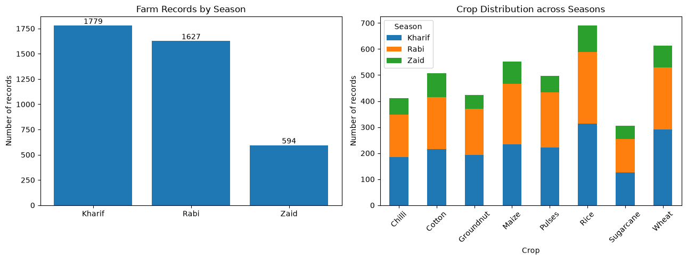
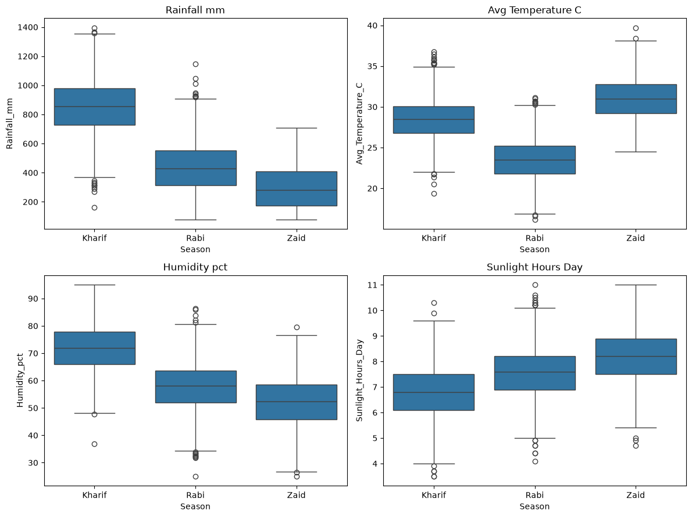
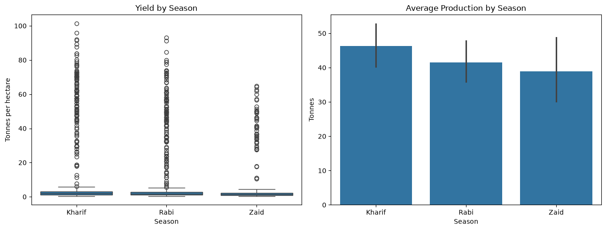
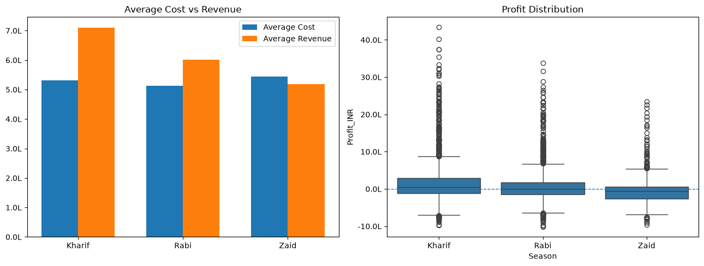
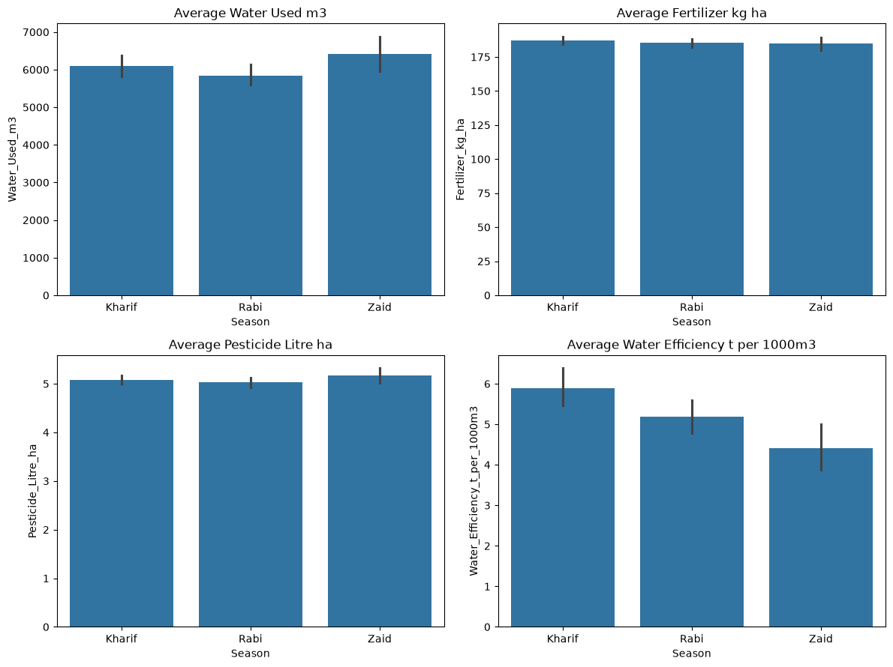
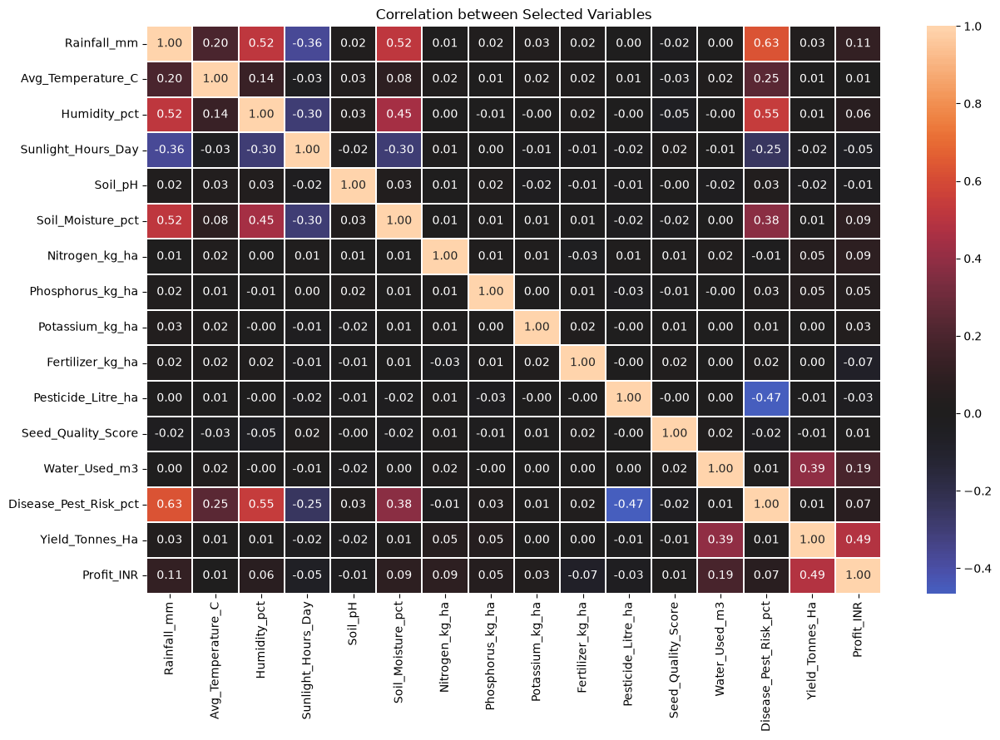

# 🌾 Seasonal Agriculture Performance Analysis

<p align="center">
  <strong>Data Visualization Major Project • VOIS AICTE Program • Batch 2026–2027</strong><br>
  <em>Understanding how agricultural seasons influence weather, productivity, profitability, resource use, and risk.</em>
</p>

<p align="center">
  
</p>

---

## 📌 Project Overview

Agricultural performance in India changes significantly across the **Kharif, Rabi, and Zaid** seasons. This project analyzes **4,000 farm records** to examine whether seasonal differences are reflected in:

- 🌦️ Weather conditions
- 🌾 Crop yield and production
- 💰 Cost, revenue, and profit
- 💧 Water and input usage
- 🚜 Irrigation patterns
- 🐛 Disease and pest risk
- 📊 Relationships between environmental, input, yield, and profit variables
- 🗺️ Crop- and state-level performance

The objective is not simply to compare averages, but to identify where seasonal performance differs and where a season-level average can hide important crop or state-level variation.

---

## 🎯 Key Questions

This analysis focuses on five practical questions:

1. **Which season delivers the strongest agricultural productivity?**
2. **Which season is financially most sustainable?**
3. **How do weather and resource-use patterns change across seasons?**
4. **Does higher resource use correspond with better yield or profit?**
5. **Do crop and state-level results tell the same story as overall seasonal averages?**

---

## 📊 Dataset at a Glance

| Metric | Value |
|---|---:|
| Farm records | **4,000** |
| Variables | **28** |
| Seasons | **3** |
| States | **8** |
| Crops | **8** |
| Duplicate rows | **0** |
| Duplicate Farm IDs | **0** |

### Seasons
**Kharif • Rabi • Zaid**

### States
Andhra Pradesh, Gujarat, Karnataka, Madhya Pradesh, Maharashtra, Punjab, Tamil Nadu, Telangana

### Crops
Chilli, Cotton, Groundnut, Maize, Pulses, Rice, Sugarcane, Wheat

---

## 🔎 Data Quality

The notebook checks structure, data types, missing values, and duplicates before analysis.

Missing values found in the dataset:

| Column | Missing | Percentage |
|---|---:|---:|
| Rainfall | 48 | 1.2% |
| Soil Moisture | 40 | 1.0% |
| Yield | 32 | 0.8% |

No exact duplicate rows or duplicate `Farm_ID` values were found.

> **Note:** The notebook removes exact duplicate rows, but it does not silently replace the reported missing values with fabricated values. Missingness is explicitly identified as part of the analysis.

---

# 📈 Visual Analysis

## 1. Season & Crop Distribution

The dataset contains **1,779 Kharif**, **1,627 Rabi**, and **594 Zaid** records. The crop distribution chart shows how the available farm records are distributed across seasons.

<p align="center">
  
</p>

---

## 2. Seasonal Weather Profile

The seasonal weather distributions show a clear environmental separation:

| Season | Rainfall (mm) | Avg. Temp (°C) | Humidity (%) | Sunlight (hrs/day) |
|---|---:|---:|---:|---:|
| **Kharif** | 852.08 | 28.45 | 71.81 | 6.79 |
| **Rabi** | 436.00 | 23.49 | 57.89 | 7.59 |
| **Zaid** | 299.42 | 31.04 | 52.01 | 8.18 |

<p align="center">
  
</p>

**Interpretation:** Kharif is the wettest and most humid season in the dataset, while Zaid has the highest average temperature and sunlight exposure.

---

## 3. Yield & Production

Average yield follows a consistent seasonal order:

| Season | Average Yield (t/ha) |
|---|---:|
| 🥇 **Kharif** | **5.64** |
| 🥈 **Rabi** | **5.08** |
| 🥉 **Zaid** | **4.67** |

<p align="center">
  
</p>

The yield boxplot also shows substantial dispersion and many high-value observations, so comparing only the mean would hide important variability.

---

# 💰 4. Economics: Cost, Revenue & Profit

This is where the seasonal differences become most important.

| Season | Avg. Cost | Avg. Revenue | Avg. Profit |
|---|---:|---:|---:|
| **Kharif** | ₹5.32L | ₹7.11L | **₹1.79L** |
| **Rabi** | ₹5.14L | ₹6.02L | **₹0.88L** |
| **Zaid** | ₹5.44L | ₹5.19L | **−₹0.25L** |

<p align="center">
  
</p>

### 🚨 Loss-making farms

| Season | Farms with Negative Profit |
|---|---:|
| **Kharif** | 42.2% |
| **Rabi** | 51.1% |
| **Zaid** | **64.5%** |

**Key finding:** Zaid combines the **highest average cost** with the **lowest average revenue**, resulting in a negative average profit and the highest share of loss-making farms.

---

# 💧 5. Resource Usage & Water Efficiency

| Season | Water Used (m³) | Fertilizer (kg/ha) | Pesticide (L/ha) | Water Efficiency (t/1,000m³) |
|---|---:|---:|---:|---:|
| **Kharif** | 6,102.20 | 187.08 | 5.08 | **5.89** |
| **Rabi** | 5,846.99 | 185.41 | 5.02 | **5.19** |
| **Zaid** | **6,419.89** | 184.64 | **5.17** | **4.41** |

<p align="center">
  
</p>

### What stands out?

- Zaid uses the **most water on average**.
- Zaid has the **lowest water efficiency**.
- Fertilizer usage changes only slightly between seasons.
- Pesticide use is also relatively close across seasons.

This suggests that the seasonal performance gap cannot be explained by fertilizer quantity alone.

---

# 🚜 6. Irrigation Pattern

The irrigation mix is surprisingly stable:

| Season | Drip | Flood | Rainfed | Sprinkler |
|---|---:|---:|---:|---:|
| **Kharif** | 22.8% | **33.2%** | 26.0% | 18.0% |
| **Rabi** | 22.7% | **32.3%** | 26.9% | 18.0% |
| **Zaid** | 23.6% | **32.7%** | 23.6% | 20.2% |

**Flood irrigation remains the most common method in all three seasons**, with only small changes in the overall irrigation mix.

---

# 🐛 7. Disease & Pest Risk

Average disease/pest risk:

| Season | Average Risk |
|---|---:|
| **Kharif** | **54.47%** |
| **Rabi** | 40.48% |
| **Zaid** | 38.22% |

Kharif has the highest disease/pest risk in the dataset, alongside its substantially higher rainfall and humidity.

> This is an observed seasonal association in the dataset, not proof that rainfall or humidity alone causes the higher risk.

---

# 🔗 8. Correlation Analysis

The notebook uses correlation as a **screening tool**, not as a causal model.

<p align="center">
  
</p>

### Strongest observed relationships with Yield

| Variable | Correlation |
|---|---:|
| Profit | **0.490** |
| Water Used | **0.389** |
| Nitrogen | 0.054 |
| Phosphorus | 0.048 |
| Rainfall | 0.031 |
| Soil pH | −0.021 |

### Strongest observed relationships with Profit

| Variable | Correlation |
|---|---:|
| Yield | **0.490** |
| Water Used | 0.190 |
| Rainfall | 0.108 |
| Soil Moisture | 0.092 |
| Nitrogen | 0.085 |
| Fertilizer | −0.074 |

**Important:** Correlation measures association. It does **not** establish that one variable causes another.

---

# 🌾 9. Crop-Level Analysis

Seasonal yield patterns remain consistent across the crops analyzed:

| Crop | Kharif | Rabi | Zaid |
|---|---:|---:|---:|
| Chilli | 1.73 | 1.46 | 1.18 |
| Cotton | 1.37 | 1.19 | 0.95 |
| Groundnut | 1.48 | 1.22 | 1.04 |
| Maize | 2.97 | 2.61 | 2.30 |
| Pulses | 1.04 | 0.87 | 0.65 |
| Rice | 2.71 | 2.33 | 1.90 |
| Sugarcane | 53.46 | 43.94 | 38.42 |
| Wheat | 2.26 | 2.06 | 1.75 |

For every listed crop, the notebook shows:

**Kharif yield > Rabi yield > Zaid yield**

---

# 🗺️ 10. State-Level Profitability

Seasonal averages hide substantial state-level differences.

| State | Kharif | Rabi | Zaid |
|---|---:|---:|---:|
| Andhra Pradesh | ₹169,316 | ₹26,316 | −₹84,085 |
| Gujarat | ₹217,051 | ₹82,846 | −₹106,930 |
| Karnataka | ₹201,226 | ₹70,953 | ₹23,311 |
| Madhya Pradesh | ₹134,242 | ₹61,576 | ₹210 |
| Maharashtra | ₹168,801 | ₹159,582 | −₹40,598 |
| Punjab | ₹133,779 | ₹169,295 | ₹62,110 |
| Tamil Nadu | ₹211,304 | ₹70,457 | −₹15,175 |
| Telangana | ₹199,668 | ₹62,825 | −₹34,621 |

### Important observation

Zaid profitability is **not uniformly negative across every state**. Karnataka and Punjab remain profitable on average in Zaid, while several other states show losses.

This is why the project goes beyond a simple three-season comparison.

---

# 🧠 Major Findings

### 01 — Kharif leads on overall productivity
Kharif records the highest average yield at **5.64 t/ha**, followed by Rabi at **5.08** and Zaid at **4.67**.

### 02 — Profitability is the biggest seasonal separator
Kharif averages approximately **₹1.79 lakh profit**, Rabi approximately **₹0.88 lakh**, while Zaid averages approximately **−₹0.25 lakh**.

### 03 — Zaid has the highest financial risk
**64.5%** of Zaid farms are loss-making, compared with **42.2%** for Kharif and **51.1%** for Rabi.

### 04 — Zaid is less water-efficient
Zaid uses the most water but has the lowest water efficiency at **4.41 t/1,000 m³**.

### 05 — Kharif carries the highest disease/pest risk
Average risk is **54.47%** in Kharif versus **40.48%** in Rabi and **38.22%** in Zaid.

### 06 — Irrigation preference is relatively stable
Flood irrigation remains the dominant method at roughly **32–33%** across all seasons.

### 07 — Yield and water use show the clearest non-economic association
Yield has a correlation of approximately **0.39 with water use**, while most other environmental/input variables show much weaker direct correlations with yield.

### 08 — State-level results complicate the seasonal story
Some states remain profitable in Zaid while others record substantial losses, demonstrating that **season alone does not explain farm profitability**.

---

# 🧪 Analytical Workflow

```text
Raw Farm Dataset
       ↓
Data Loading & Structure Check
       ↓
Missing-Value & Duplicate Check
       ↓
Duplicate Removal
       ↓
Seasonal Grouping & Aggregation
       ↓
Weather Analysis
       ↓
Yield & Production Analysis
       ↓
Cost / Revenue / Profit Analysis
       ↓
Resource & Irrigation Analysis
       ↓
Correlation Analysis
       ↓
Crop-Level Comparison
       ↓
State-Level Comparison
       ↓
Key Findings & Interpretation
```

---

# 🛠️ Tools & Technologies

| Tool | Purpose |
|---|---|
| **Python** | Core analysis |
| **Pandas** | Data cleaning, grouping, aggregation, pivot tables |
| **NumPy** | Numerical operations |
| **Matplotlib** | Charts and visualization |
| **Seaborn** | Statistical visualization and heatmaps |
| **SciPy** | Scientific/statistical Python tooling |
| **Jupyter Notebook** | Interactive analysis environment |

---

# 📁 Project Structure

```text
Seasonal-Agriculture-Performance-Analysis/
│
├── Seasonal_Agriculture_Performance_Analysis.ipynb
├── seasonal_agriculture_performance_dataset.csv
├── Major_Project_Seasonal_Agriculture_Performance_Analysis.pdf
├── Major Project_Seasonal Agriculture-02.pptx
│
└── assets/
    ├── 01_season_overview.png
    ├── 02_weather_by_season.png
    ├── 03_yield_and_production.png
    ├── 04_economics_by_season.png
    ├── 05_resource_usage.png
    └── 06_correlation_heatmaps.png
```

---

# ▶️ Run the Project

### 1. Clone the repository

```bash
git clone <your-repository-url>
cd Seasonal-Agriculture-Performance-Analysis
```

### 2. Install the required libraries

```bash
pip install pandas numpy matplotlib seaborn scipy jupyter
```

### 3. Launch Jupyter Notebook

```bash
jupyter notebook
```

### 4. Open

```text
Seasonal_Agriculture_Performance_Analysis.ipynb
```

Make sure the CSV file is in the same working directory as the notebook before running the analysis.

---

# 📌 Project Limitations

- The analysis is based on the supplied **4,000-record dataset**.
- Correlation results indicate **association, not causation**.
- Season-level averages can hide crop- and state-specific differences.
- Missing values exist in Rainfall, Soil Moisture, and Yield.
- The notebook does not establish causal relationships between weather, inputs, yield, profit, or disease risk.
- The analysis is descriptive/exploratory rather than a predictive farming model.

---

# 💼 Skills Demonstrated

**Data Analysis**
- Data inspection
- Missing-value analysis
- Duplicate detection
- GroupBy aggregation
- Pivot tables
- Comparative analysis
- Correlation analysis

**Data Visualization**
- Bar charts
- Stacked bar charts
- Box plots
- Heatmaps
- Multi-panel visualizations

**Analytical Thinking**
- Season-wise benchmarking
- Profitability analysis
- Resource-efficiency analysis
- Crop-level analysis
- State-level analysis
- Risk interpretation

---

# 👨‍💻 Author

**Chitranjan Vishwakarma**  
BCA Student — Sri Ram Kishun P.G. College, Gokul, Karsada, Varanasi

**Project:** Seasonal Agriculture Performance Analysis  
**Program:** VOIS AICTE Major Project — Data Visualization Track  
**Batch:** 2026–2027

---

<p align="center">
  <strong>🌾 Turning agricultural data into seasonal performance insights.</strong>
</p>
